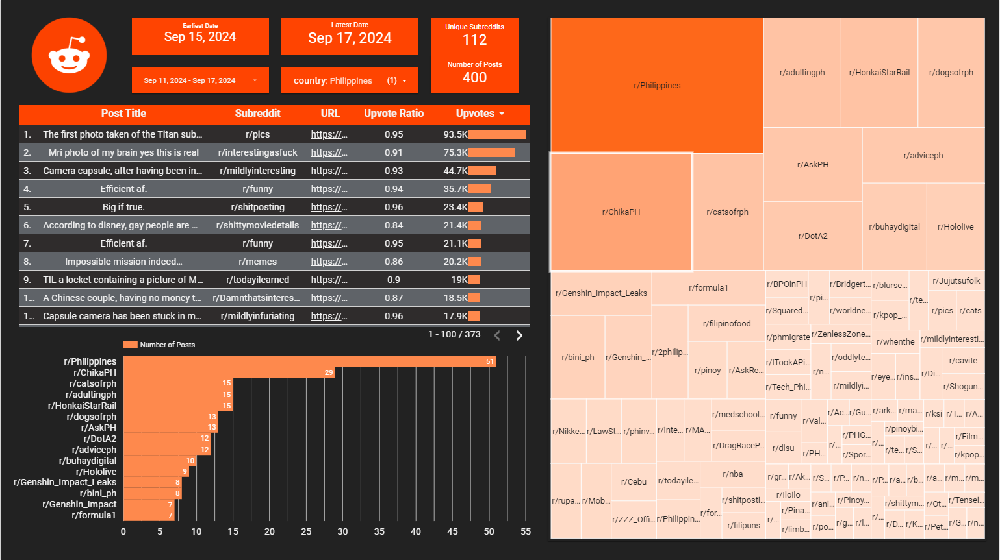

# r/popular Subreddit Pipeline


This project extracts Reddit data from [r/popular](https://www.reddit.com/r/popular/) through a combination of web scraping and API calls. The final output, which is shown below, is a Google Data Studio report showcasing the popular subreddits in each of the available regions of Southeast Asia (Malaysia, Philippines, Singapore, and Thailand). 

[](https://lookerstudio.google.com/reporting/96069bbf-320f-45f0-8130-c95e1a274106)

* The Google Data Studio dashboard can be interacted with through this [link](https://datastudio.google.com/reporting/e927fef6-b605-421c-ae29-89a66e11ea18).


## Observations


This project was made based on the interest of knowing how redditors from Southeast Asia (SEA) spend their time on the platform. Initial results have yielded the following observations

1. Redditors from the Philippines tend to participate more on their own local subreddits. 

    *  A potential reason for this may be the abundance of local subreddits catered towards their own specific topics. Other countries in SEA might only have a few local subreddits where topics can be mixed. 

2. Other countries in SEA have a few local subreddits with diverse topics.

    * Malaysia has r/Malaysia and r/Bolehland as their popular local subreddits.
    * Thailand has r/Thailand as their popular local subreddit.

3. Mobile gaming subreddits (Genshin Impact, Zenless Zone Zero, and Honkai Star Rail) are popular in Malaysia, Philippines, and Thailand. 
    
    * Mobile gaming is very popular in SEA because of the large supply of cheap phones.   

4. Singapore's own subreddit r/Singapore is not popular in the region.

    * Singapore may be using another social media platform to discuss local topics. Redditors from Singapore instead use Reddit to participate in international subreddits.  


## Architecture

This project was also made with the desire to practice several tools in handling data. Frankly, some of the tools overcomplicate the project like the use of cloud based storage. At the same time, using them also provides a good opportunity to develop the skills in using such tools.    

1. Extract data using Reddit API
2. Load into **GCP Buckets**
3. Copy into **GCP Bigquery** 
4. Transform using **dbt**
5. Create a **Google Data Studio** dashboard 
6. Orchestrate workflow using **Apache Airflow** inside a **Docker** container
7. Manage GCP resources using **Terraform**

## How this pipeline works

1. The pipeline starts by scraping the post urls from r/popular since Reddit API currently does not support this feature (to my knowledge). There is this [endpoint](https://www.reddit.com/dev/api/#GET_{sort}) but I do not know if this will work with specific regions or just the whole subreddit in general.

     Each post url is then passed through the Reddit API to obtain the post details. The api returns a JSON object, and the script extracts the necessary details. The post details are turned into a `pandas Dataframe` and then saved into a parquet file.

    * See [extract.py](./airflow/extract_load/extract.py)

    * NOTE: If you wish to change the regions, change the variable `countries` in line 98

2. Parquet files are then uploaded into a GCP bucket. Then the files in the bucket are copied into a GCP Bigquery table. 

    * See [load_bucket.py](./airflow/extract_load/load_bucket.py) and [load_bq.py](./airflow/extract_load/load_bq.py)

3. The data in the initial Bigquery table is transformed through dbt cloud

    * See [dbt folder](./dbt/)


Steps 1 and 2 compose the single [DAG](./airflow/dags/pipeline.py) being run through Apache Airflow. The orchestration tool is inside a Docker container defined by the [docker-compose.yaml](./airflow/docker-compose.yaml) file. The dbt transformation is scheduled through its own job in the dbt cloud platform.

## Prequisites


1. GCP Account
2. Docker
3. Python
4. Terraform
5. Reddit Account
6. DBT Cloud Account
 
## Setup

* NOTE: We rename files for .gitignore purposes

#### Environment Variables

1. Run the command below and fill in the required variables

  ```bash
  cd .\airflow\
  mv dev.env .env
  ```

2. Download your GCP service account keys and store it into google_keys.json then run the command below. This is not the best practice to be honest.  

  ```bash
  cd .\airflow\
  mv google_keys.json keys.json
  ```

#### Terraform

1. Fill in [var.tf](./var.tf) with the required GCP variables then run the command below 

  ```bash
  mv var.tf variables.tf

  terraform init
  terraform apply
  ```

#### Docker and Airflow

1. Run the command below

  ```bash
  cd .\airflow\

  docker compose build
  docker compose up airflow-init
  docker compose up -d

  ```
  * NOTE: Only run `docker compose up -d` on subsequent runs

2. Go to `localhost:8080` to trigger the DAG or schedule it in a cloud service

#### DBT Cloud

1. Search on YouTube for tutorial or follow [DE Zoomcamp Week 4](https://dezoomcamp.streamlit.app/Module%204%20Analytics%20Engineering)

#### Google Data Studio

1. Search on YouTube for tutorial

